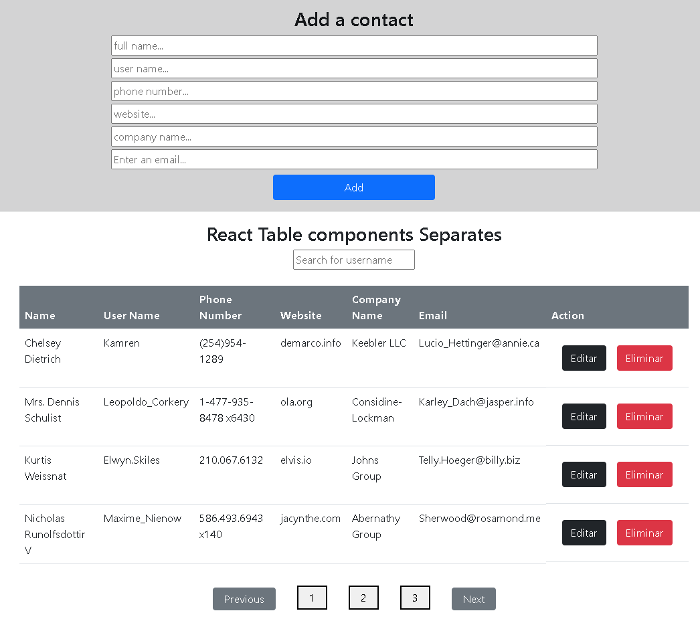
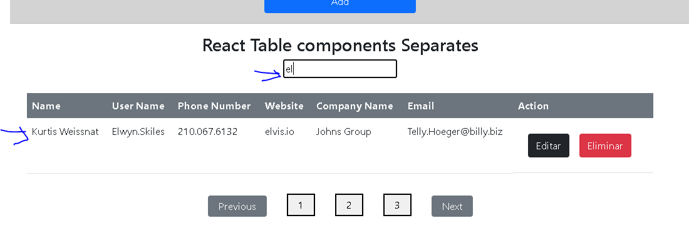
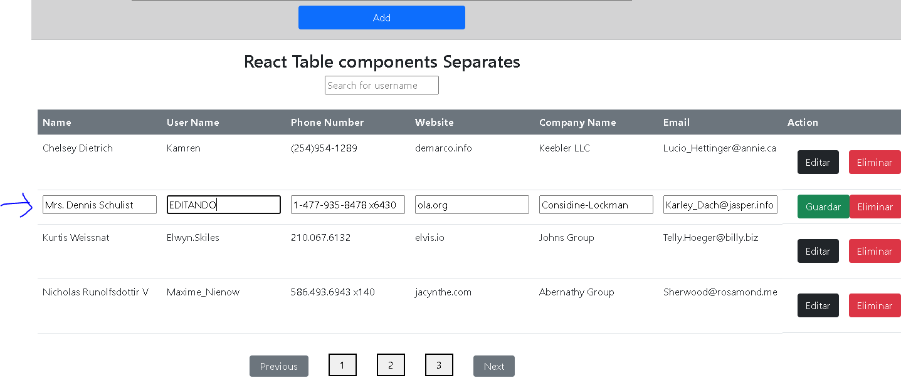

# react-table-component-separates
Tabla crud react. Separando componentes de Edit, Filter, Sorting, Searching, Pagination, etc.<br>

Datos con arreglo de datos en archivo Data.js<br>

 ### estilos con bootStrap 

## Instalación
Para ejecutar este proyecto, ejecute localmente usando npm:

```
$ npm install
$ npm run start
```





