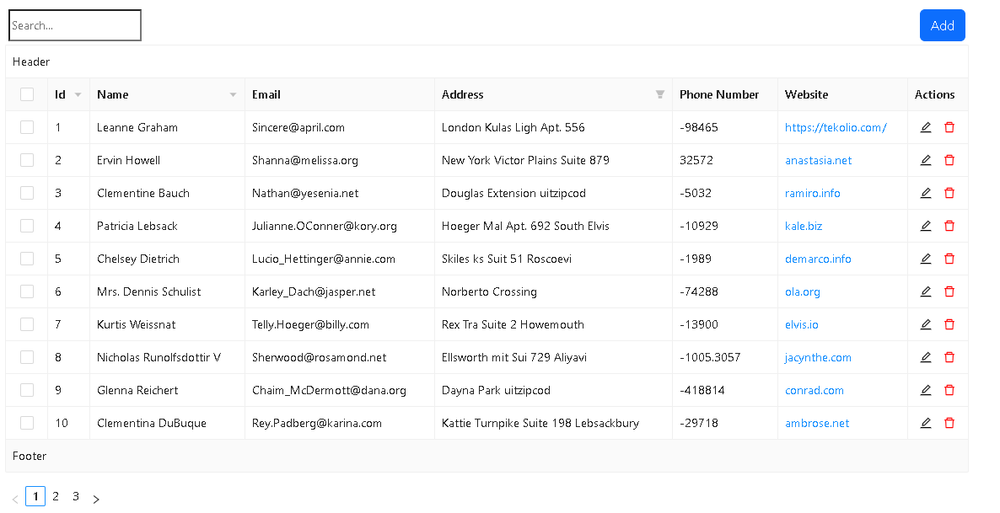
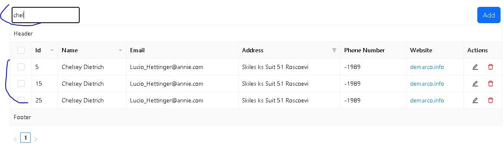
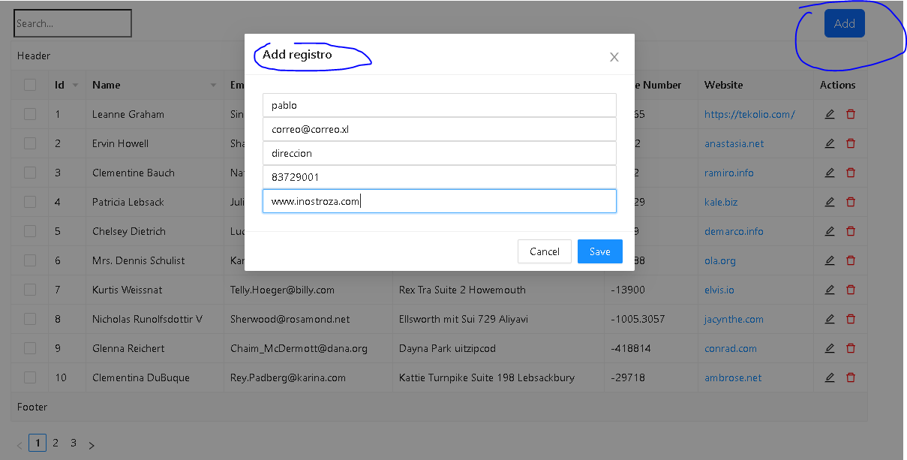
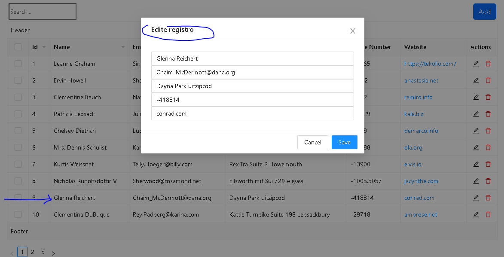
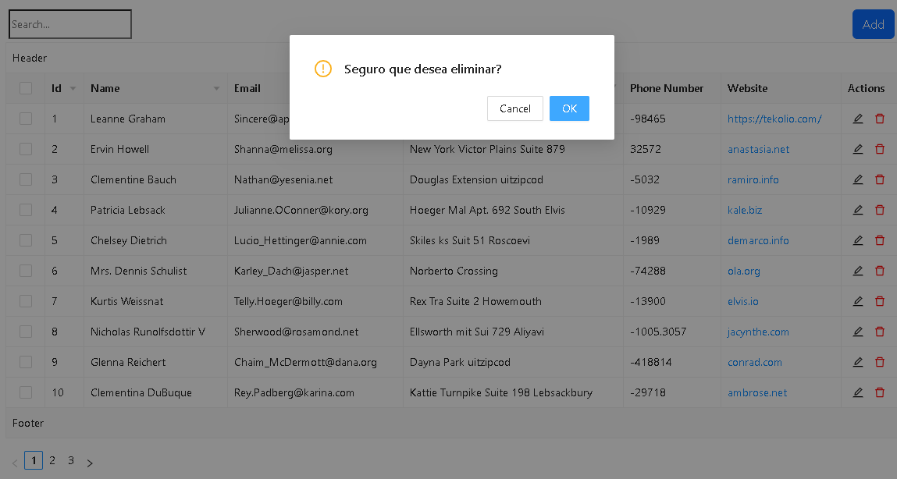

# react-table-antd

Tablas en react (Crud, Filter, Sorting, Searching, Pagination, etc).<br>

Archivo de pruebas datos.js<br>

 ### npm i 
 antd <br>


## Documentación
[table-modal-antd](https://ant.design/components/table/#components-table-demo-pagination)

## Instalación
Para ejecutar este proyecto, ejecute localmente usando npm:

```
$ npm install
$ npm run start
```






