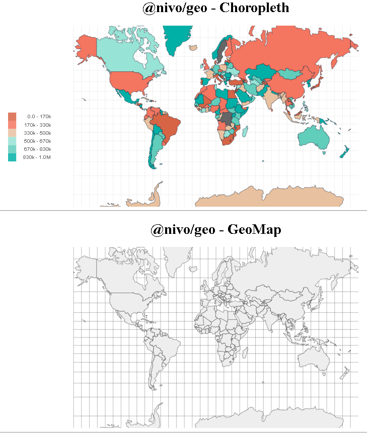
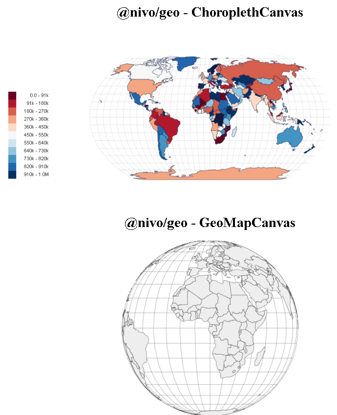
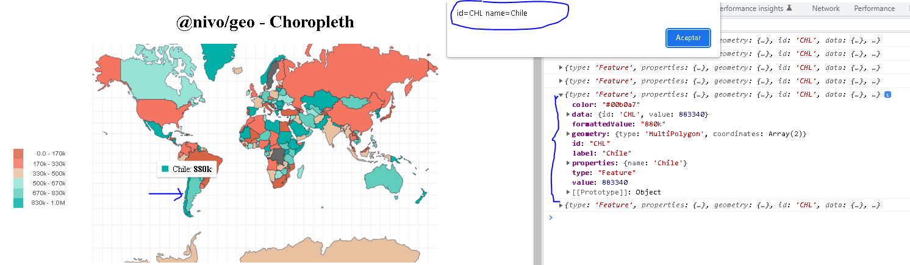
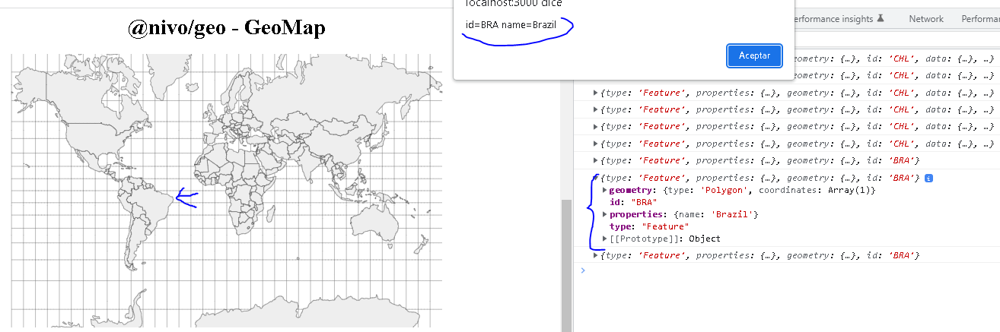

# React-nivo-geo
Diseño mapa en versión SVG o Canvas.<br> 
Incluye data de todos los paises del mundo.<br>

 ### npm i 
 @nivo/geo <br>


## Documentación
[npm @nivo/geo](https://www.npmjs.com/package/@nivo/geo)<br>
[documentation](https://nivo.rocks/choropleth/)<br>

## Instalación
Para ejecutar este proyecto, ejecute localmente usando npm:

```
$ npm install
$ npm run start
```





