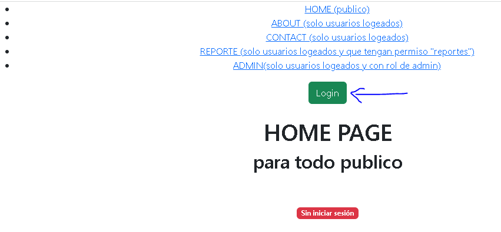
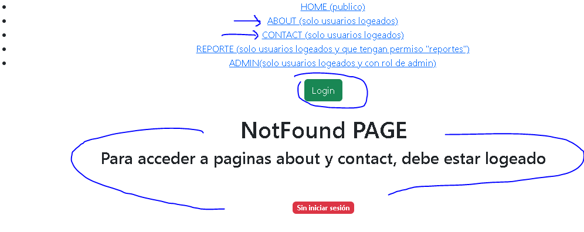
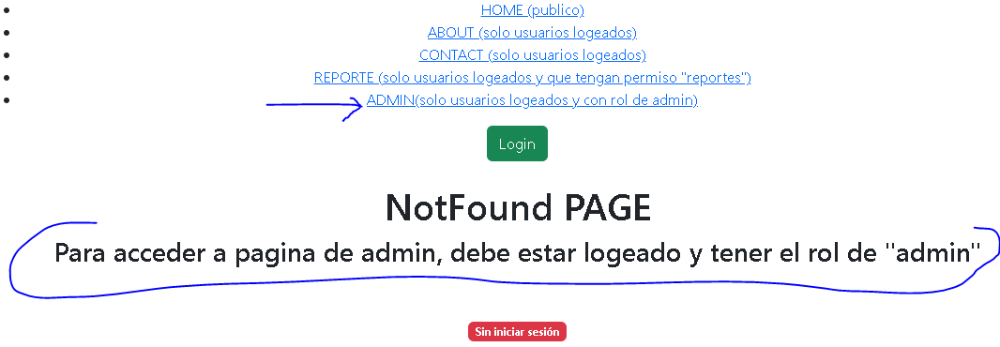
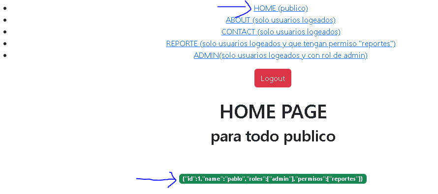
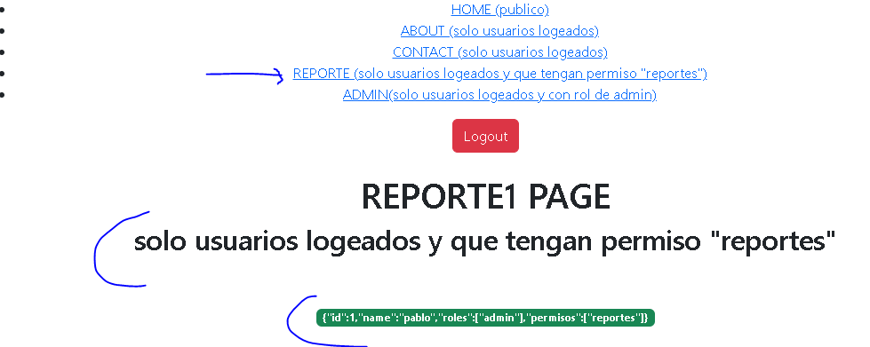
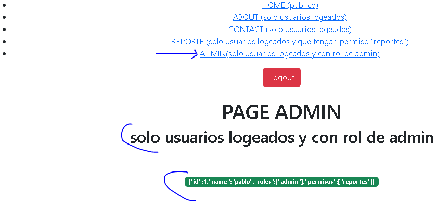

# react-routes-protected
Ejemplo practico para proteger paginas a usuarios autenticados, con rol y permisos especificos.<br>

 ### npm i 
 react-router-dom <br>
 react-bootstrap <br>

### css bootstrap 
<link rel="stylesheet" href="https://cdn.jsdelivr.net/npm/bootstrap@5.2.0-beta1/dist/css/bootstrap.min.css"
    integrity="sha384-0evHe/X+R7YkIZDRvuzKMRqM+OrBnVFBL6DOitfPri4tjfHxaWutUpFmBp4vmVor" crossorigin="anonymous" /> <br>


## Instalación
Para ejecutar este proyecto, ejecute localmente usando npm:

```
$ npm install
$ npm run start
```








