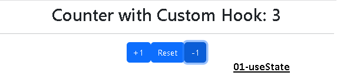
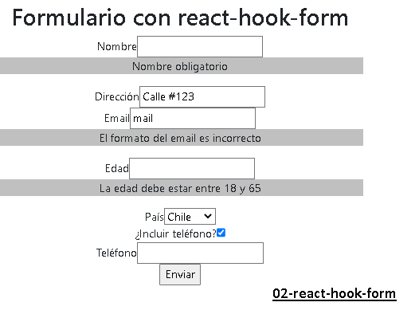
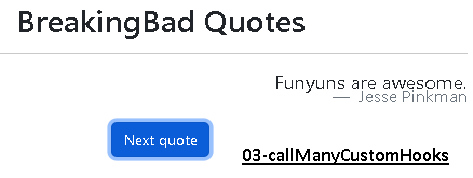
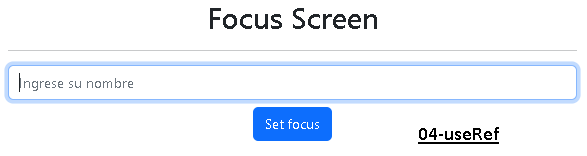
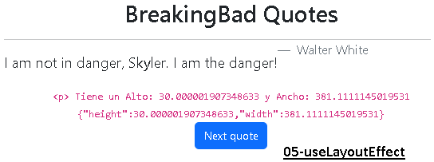
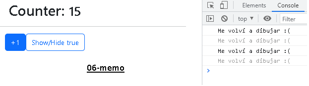
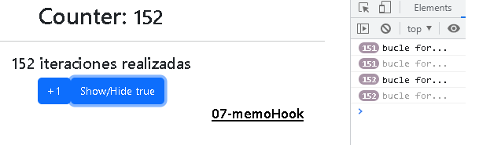
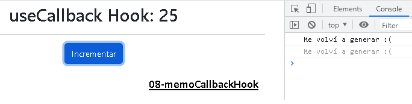
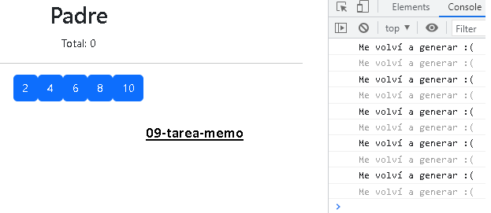

# Hooks
Ejemplos de custom hooks varios.<br>

 ### npm i 
 react-dom <br>
 react-hook-form <br>

### Hooks ejemplos
 useState <br>
 react-hook-form <br>
 call api <br>
 useRef <br>
 useLayoutEffect <br>
 memo <br>
 memoHook <br>
 memoCallbackHook <br>


## Instalación
Para ejecutar este proyecto, ejecute localmente usando npm:

```
$ npm install
$ npm run start
```












