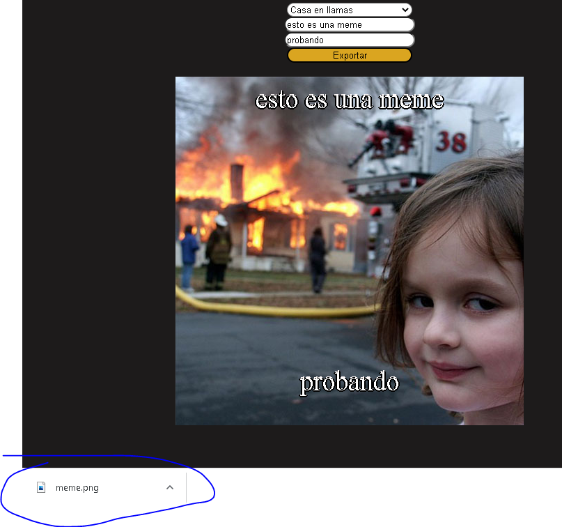
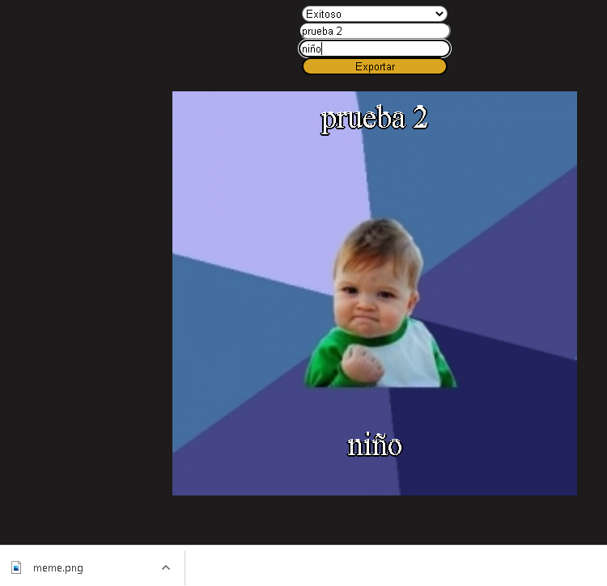

# react-memes

Ejemplo desarrollado con react y html2canvas<br>
Puedes generar memes y descargarlos<br>


## Instalación
Para ejecutar este proyecto, ejecute localmente usando npm:

```
$ npm install
$ npm run start
```


