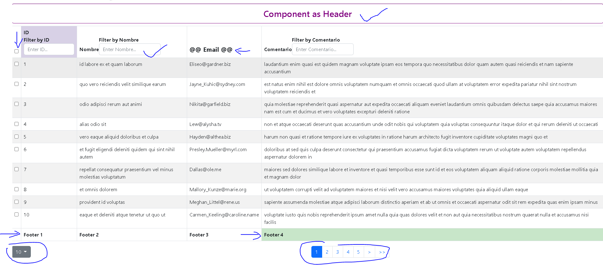

# react-tables

Tablas en react (Edit, Filter, Sorting, Searching, Pagination, etc).<br>

Api de pruebas https://jsonplaceholder.typicode.com/comments<br>

 ### npm i 
 react-bootstrap-table-next <br>
 react-bootstrap-table2-paginator <br>
 react-bootstrap-table2-editor <br>
 react-bootstrap-table2-filter <br>


## Documentación
[react-bootstrap-table](https://react-bootstrap-table.github.io/react-bootstrap-table2/storybook/index.html?selectedKind=Column%20Filter&selectedStory=Text%20Filter&full=0&addons=1&stories=1&panelRight=0&addonPanel=storybook%2Factions%2Factions-panel)

## Instalación
Para ejecutar este proyecto, ejecute localmente usando npm:

```
$ npm install
$ npm run start
```

