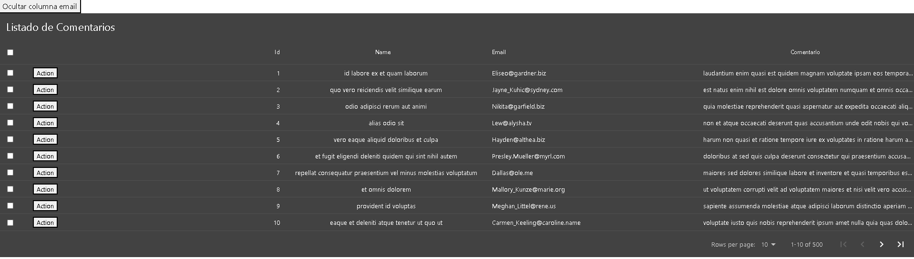

# react-tables

Tablas en react (Edit, Filter, Sorting, Searching, Pagination, etc).<br>

Api de pruebas https://jsonplaceholder.typicode.com/comments<br>

 ### npm i 
 react-data-table-component <br>


## Documentación
[react-data-table-component](https://react-data-table-component.netlify.app/?path=/docs/getting-started-examples--page)

## Instalación
Para ejecutar este proyecto, ejecute localmente usando npm:

```
$ npm install
$ npm run start
```


