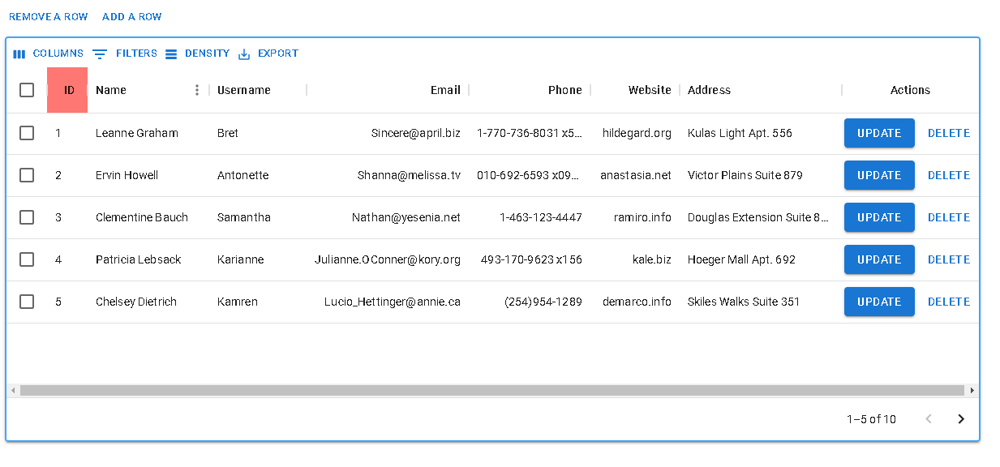
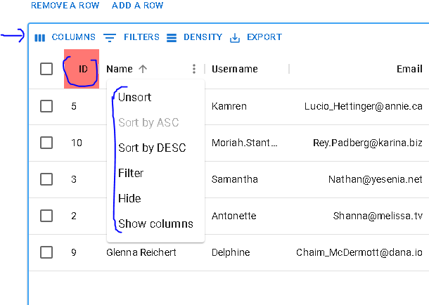
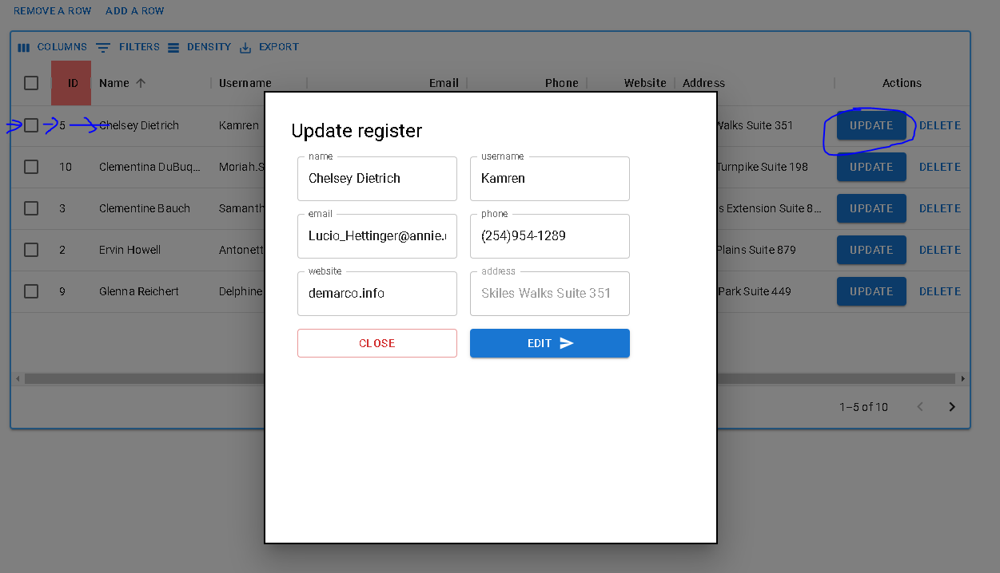
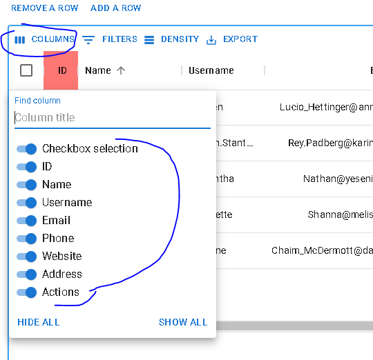
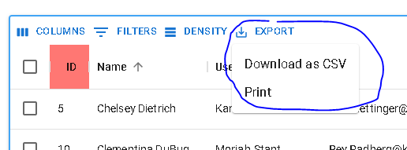
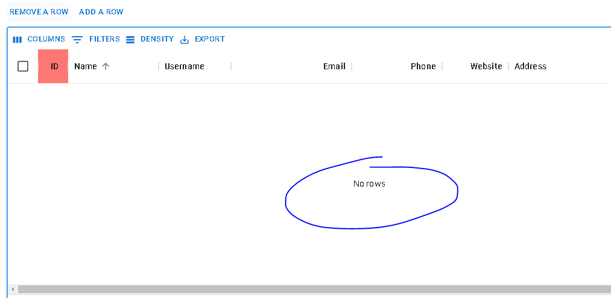

# react-mui-data-grid

Tablas en react (Crud, Filter, Sorting, Searching, Pagination, export, etc).<br>

Archivo de pruebas datos.js<br>

 ### npm i 
 @mui/material <br>
 @mui/icons-material <br> 
 @mui/x-data-grid <br>

## Documentación
[material ui datagrid](https://mui.com/x/react-data-grid/)

## Instalación
Para ejecutar este proyecto, ejecute localmente usando npm:

```
$ npm install
$ npm run start
```







