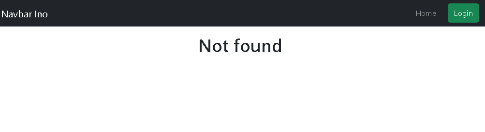
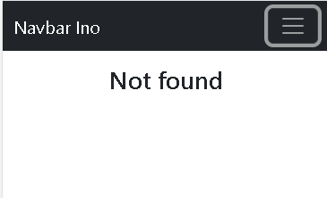
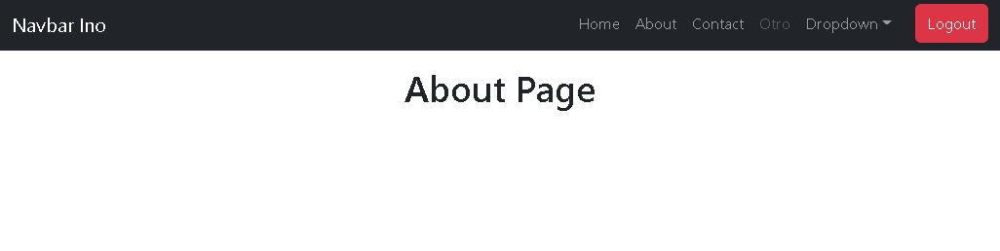

# react-navbar-bootstrap

Navbar responsivo con rutas privadas y publicas con un simple login.<br>

Api de pruebas https://jsonplaceholder.typicode.com/users<br>

 ### npm i 
 react-bootstrap <br>

### css bootstrap 
<link rel="stylesheet" href="https://cdn.jsdelivr.net/npm/bootstrap@5.2.0-beta1/dist/css/bootstrap.min.css"
    integrity="sha384-0evHe/X+R7YkIZDRvuzKMRqM+OrBnVFBL6DOitfPri4tjfHxaWutUpFmBp4vmVor" crossorigin="anonymous" /> <br>

## Documentación
[react bootstrap navbar](https://react-bootstrap.github.io/components/navbar/)

## Instalación
Para ejecutar este proyecto, ejecute localmente usando npm:

```
$ npm install
$ npm run start
```





