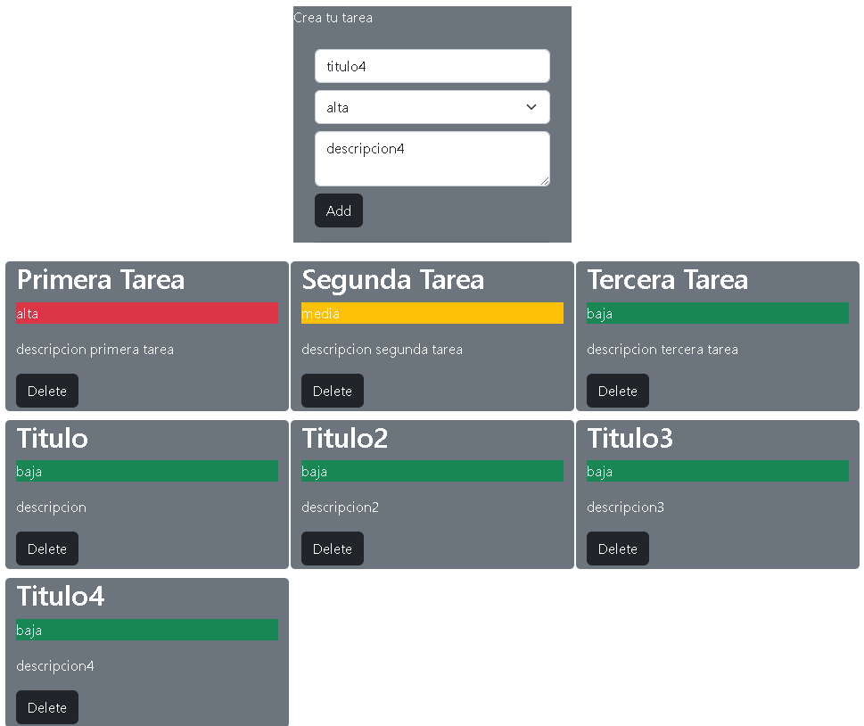

# react-task-bootstrap
## Ejemplo con TaskContext y createContext
Ejemplo basico, desarrollado con react y bootstrap<br>
Fuente de datos archivo .js con datos<br>

## Publicación
[react-task-bootstrap](https://inosttroza.github.io/react-task/)

## Instalación
Para ejecutar este proyecto, ejecute localmente usando npm:

```
$ npm install
$ npm run start
```


